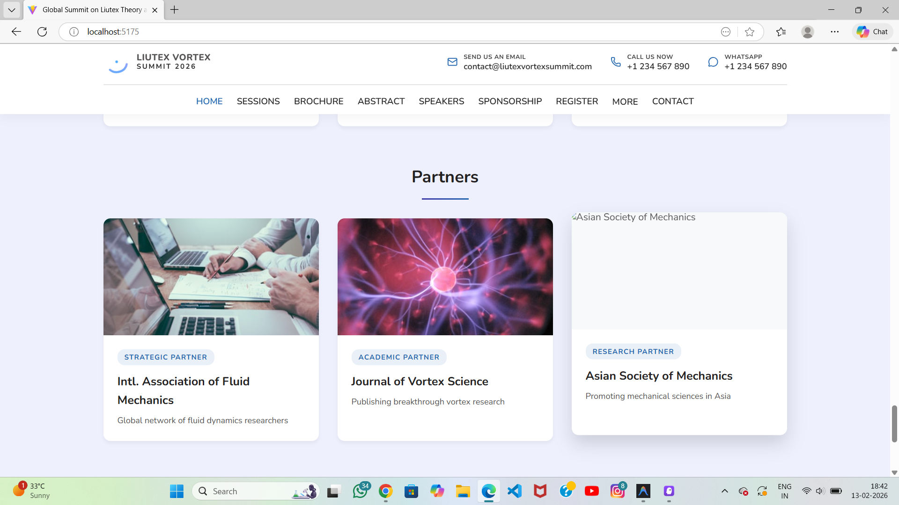

# Requirements Document

## Introduction

This document specifies the requirements for implementing a custom background image for the home page hero section. The feature will replace the current Unsplash background with a locally-hosted, scientific-themed background image that maintains text readability and professional aesthetics while improving performance and reliability.

## Glossary

- **Hero_Section**: The primary landing section of the home page containing the event title, countdown timer, description, action buttons, and info cards
- **Background_Image**: The visual backdrop displayed behind the hero section content
- **Overlay**: A semi-transparent dark gradient layer positioned between the background image and foreground content to ensure text readability
- **Image_Asset**: A static image file stored locally in the project's assets directory
- **Responsive_Design**: The capability of the background image to adapt and display correctly across different screen sizes and devices

## Requirements

### Requirement 1: Local Image Asset Management

**User Story:** As a developer, I want to use a locally-hosted background image, so that the application has better performance, reliability, and control over the visual assets.

#### Acceptance Criteria

1. THE Image_Asset SHALL be stored in the src/assets/images/ directory
2. THE Hero_Section SHALL reference the local Image_Asset instead of an external URL
3. WHEN the application builds, THE Image_Asset SHALL be bundled with the application assets
4. THE Image_Asset SHALL be in a web-optimized format (JPEG, PNG, or WebP)
5. THE Image_Asset SHALL have a file size optimized for web delivery (under 500KB)

### Requirement 2: Scientific Theme and Visual Quality

**User Story:** As a conference organizer, I want the background to feature scientific or laboratory imagery, so that it visually represents the academic nature of the Liutex Theory summit.

#### Acceptance Criteria

1. THE Background_Image SHALL feature scientific equipment, laboratory settings, or vortex dynamics related imagery
2. THE Background_Image SHALL maintain a professional and academic aesthetic
3. THE Background_Image SHALL be high resolution (minimum 1920x1080 pixels)
4. THE Background_Image SHALL have a dark or neutral color palette that complements the existing overlay
5. THE Background_Image SHALL not contain distracting elements that compete with foreground text and UI components

### Requirement 3: Text Readability and Overlay

**User Story:** As a user, I want the hero section text to remain clearly readable, so that I can easily understand the event information and call-to-action buttons.

#### Acceptance Criteria

1. THE Overlay SHALL remain positioned between the Background_Image and foreground content
2. THE Overlay SHALL use the existing dark gradient (rgba(0, 0, 0, 0.4) to rgba(0, 0, 0, 0.7))
3. WHEN the Background_Image is displayed, THE foreground text SHALL maintain sufficient contrast for readability
4. THE Hero_Section SHALL ensure all text elements (title, countdown, description, buttons) remain visible against the new background
5. THE Overlay opacity and gradient SHALL be adjustable if needed to maintain readability with the new background

### Requirement 4: Responsive Design and Cross-Device Compatibility

**User Story:** As a user on any device, I want the background image to display correctly, so that I have a consistent visual experience regardless of screen size.

#### Acceptance Criteria

1. WHEN viewed on desktop screens, THE Background_Image SHALL cover the full hero section without distortion
2. WHEN viewed on tablet devices, THE Background_Image SHALL maintain proper aspect ratio and positioning
3. WHEN viewed on mobile devices, THE Background_Image SHALL remain visible and properly scaled
4. THE Background_Image SHALL use CSS background-size: cover to maintain proper scaling
5. THE Background_Image SHALL use CSS background-position: center to ensure optimal focal point visibility across all screen sizes

### Requirement 5: CSS Implementation and Styling

**User Story:** As a developer, I want the background image implementation to follow existing CSS patterns, so that the code remains maintainable and consistent with the current architecture.

#### Acceptance Criteria

1. THE Background_Image SHALL be applied via the CSS background-image property in HeroSection.css
2. THE Hero_Section SHALL maintain the existing CSS class structure (.hero, .hero__overlay, .hero__container)
3. WHEN the Background_Image path is updated, THE application SHALL reflect the change without requiring component logic modifications
4. THE CSS implementation SHALL preserve all existing hero section styles (padding, min-height, display properties)
5. THE Background_Image reference SHALL use a relative path compatible with Vite's asset handling

### Requirement 6: Performance and Loading

**User Story:** As a user, I want the page to load quickly, so that I can access event information without delay.

#### Acceptance Criteria

1. THE Background_Image SHALL be optimized for web delivery with appropriate compression
2. WHEN the hero section loads, THE Background_Image SHALL not block rendering of critical content
3. THE Background_Image SHALL leverage browser caching for repeat visits
4. THE Image_Asset SHALL be processed by Vite's build optimization pipeline
5. THE Background_Image SHALL load with appropriate priority to balance visual presentation and performance
